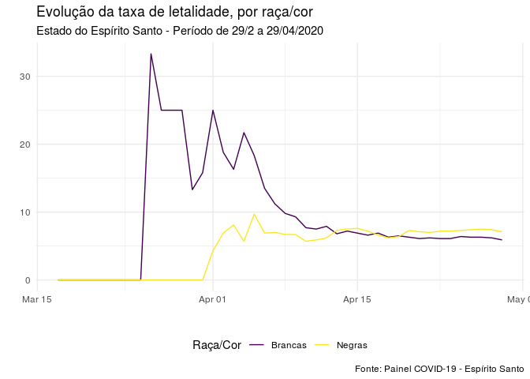
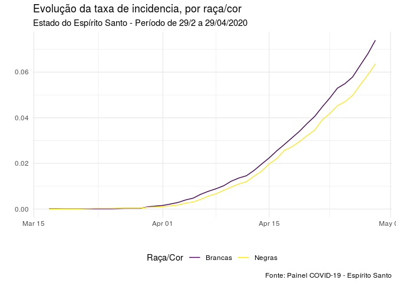
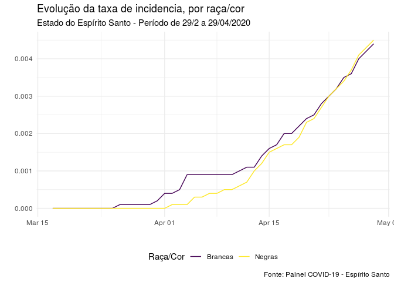
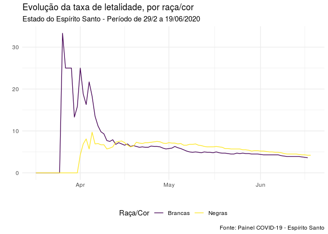
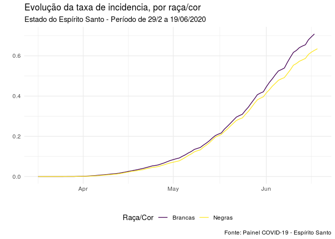
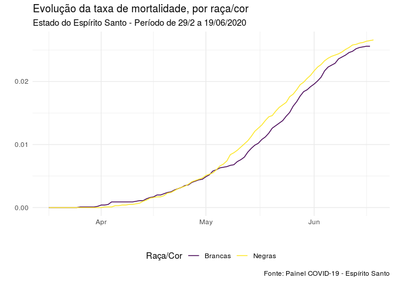

Análise - OCOFA
================

# Análise até 29/04/2020
<<<<<<< HEAD

| raca\_cor | n\_casos | n\_mortes |     pop | letalidade | incidencia | mortalidade |
| :-------- | -------: | --------: | ------: | ---------: | ---------: | ----------: |
| Brancas   |     1096 |        65 | 1481678 |        5.9 |     0.0740 |      0.0044 |
| Negras    |     1273 |        91 | 2002130 |        7.1 |     0.0636 |      0.0045 |

<!-- --><!-- --><!-- -->

# Análise até agora

| raca\_cor | n\_casos | n\_mortes |     pop | letalidade | incidencia | mortalidade |
| :-------- | -------: | --------: | ------: | ---------: | ---------: | ----------: |
=======

<!-- --><!-- --><!-- -->

# Análise até agora

| raca\_cor | n\_casos | n\_mortes |     pop | letalidade | incidencia | mortalidade |
| :-------- | -------: | --------: | ------: | ---------: | ---------: | ----------: |
>>>>>>> 2902f33b0f4de958833cc9e5e429464c271c7575
| Brancas   |    10856 |       380 | 1481678 |        3.5 |     0.7327 |      0.0256 |
| Negras    |    12937 |       532 | 2002130 |        4.1 |     0.6462 |      0.0266 |

<!-- --><!-- --><!-- -->
